# Database Schema

## 1. Purpose and Source of Truth

This document describes the PostgreSQL schema backing the website: every physical table, its
columns, types, nullability, defaults and constraints, and how the entities relate to one
another.

The schema is defined **in full by the single alembic revision**
`alembic/migrations/versions/0001_initial_base_schema.py` (revision id `0001`, no down
revision). There is no second revision and no out-of-band DDL: that file creates the schema,
both enum types, the shared trigger function, all twenty tables and all twenty triggers, and
its `downgrade` removes every one of them.

This document is transcribed from that revision. If the two ever disagree, **the revision is
the schema of record** and this document is the defect; any change to a width, constraint,
enum name or foreign-key action must be applied to the revision and propagated here in the
same change.

## 2. Conventions

These conventions hold for every table in the schema unless a table's own section says
otherwise.

**Schema.** Every object this revision creates lives in the `base` schema; the only object
outside it is alembic's own `alembic_version` bookkeeping table, which the revision neither
creates nor owns (see §3). Every raw-SQL statement in the revision is schema qualified, so no
object it creates depends on `search_path`.

**Primary keys.** Every table has a single-column primary key named `id` of type
`VARCHAR(32)`, holding a UUIDv7 rendered as hex with the hyphens stripped. IDs are generated
by the application using the Python 3.14 standard library, `uuid.uuid7()` — note that
`uuid.uuidv7` (as written in SPEC-001 §6.1) is not a real API and must not be used. Primary
key constraints are named `pk_{table}`.

**Foreign keys.** Every foreign-key column is `VARCHAR(32)`, matching the primary-key width it
references, and declares an explicit foreign-key constraint named `fk_{table}_{column}` with an
explicit `ON DELETE` action. Foreign-key columns are `NOT NULL` except where a table's own
section marks them nullable.

**Unique constraints.** Uniqueness is expressed with named unique constraints,
`uq_{table}_{columns}`. Every link (junction) table carries a unique constraint over its link
tuple.

**Timestamps.** Every table carries `created_at` and `updated_at`, both
`TIMESTAMP WITH TIME ZONE`, `NOT NULL`, with `server_default now()`. Values are UTC. The
form `DEFAULT (now() AT TIME ZONE 'utc')` is not used anywhere in the schema.

**`updated_at` trigger.** One trigger function, `base.set_updated_at()`, is defined for the
schema. It sets `NEW.updated_at = now()` and returns `NEW`. Each table has its own trigger
named `{table}_set_updated_at`, defined as `BEFORE UPDATE ... FOR EACH ROW EXECUTE FUNCTION
base.set_updated_at()`. Callers never write `created_at` or `updated_at` themselves.

**Named native enum types.** Two enum types are created as named PostgreSQL types so that they
can be referenced by name, cited here, and dropped on downgrade:

| Enum type | Values | Used by |
| --- | --- | --- |
| `base.http_method` | `get`, `post`, `put`, `patch`, `delete` | `base.admin_audit_log.method` |
| `base.document_type` | `spec`, `acceptance`, `other` | `base.agent_spec_document_link.document_type` |

**No secondary indexes.** The schema creates **no** secondary indexes. The only indexes that
exist are those PostgreSQL creates implicitly to back primary-key and unique constraints; these
implicit indexes are the sole exception to the ban (SPEC-001 §6.1, whose text "are nan
exception" reads "are an exception"). The revision contains no `op.create_index` call and no
`index=True` column argument.

**Comments.** Every object class carries a `COMMENT ON`: the schema, each table, each column,
the trigger function and each trigger, so operators can read the schema's intent directly from
the database.

## 3. Object Inventory

The revision owns exactly the following objects. The count is the audit list for downgrade
completeness: `alembic downgrade base` drops **all** of them — the twenty triggers, then the
twenty tables in reverse foreign-key dependency order, then the trigger function, then both
enum types, then the schema itself. The final `DROP SCHEMA base RESTRICT` is unconditional, so
nothing owned by the revision survives a downgrade.

The one object left behind is alembic's own `alembic_version` table, which the revision does not
own and never creates. It lives **outside** `base`, in the connection's default schema
(`public`), because `migrations/env.py` configures no `version_table_schema`: alembic creates
that table before the first revision body runs and never creates a schema for it, so placing it
in `base` would make `upgrade` fail against an empty database and would defeat the schema drop
on the way back down. After a downgrade it remains, empty of any row for this revision — which
is exactly what lets a subsequent `upgrade` run again.

**Deployment caveat.** Because `version_table_schema` is unset, the unqualified
`alembic_version` table follows the connection's `search_path`. Nothing in this repository sets
one, so as delivered the table lands in `public`. A deployment that sets the migration role's
`search_path` to `base` would silently place the version table inside `base` and reintroduce
both failure modes at once: `upgrade` would fail against an empty database because alembic
creates the version table before the first revision body creates the schema, and `downgrade`
would fail at the final `DROP SCHEMA base RESTRICT` because the version table it does not own
would still be inside the schema. The migration role's `search_path` must therefore be left at
the PostgreSQL default (or at least must not include `base` ahead of `public`).

| Object class | Count | Detail |
| --- | --- | --- |
| Schemas | 1 | `base` |
| Enum types | 2 | `base.http_method`, `base.document_type` |
| Trigger functions | 1 | `base.set_updated_at()` |
| Tables | 20 | listed below, in foreign-key dependency order |
| Triggers | 20 | one `{table}_set_updated_at` per table |
| Secondary indexes | 0 | only implicit PK/unique-backing indexes exist |

The twenty tables, in the foreign-key dependency order used by the revision (parents before
children; the reverse of this order is the drop order and the same order is the safe insert
order for seeding):

`base.contact`, `base.message`, `base.topic`, `base.document`, `base.article`,
`base.topic_article_link`, `base.article_comment`, `base.subagent`, `base.cv_stack_item`,
`base.cv_experience`, `base.cv_experience_responsibility`,
`base.cv_stack_item_experience_link`, `base.cv_education`, `base.api_key`,
`base.admin_audit_log`, `base.agent_spec`, `base.agent_spec_document_link`,
`base.cv_skill_category`, `base.cv_stack_item_category_link`, `base.project`.

## 4. Tables

Each table below is listed with its full column set, including the `id` primary key and the two
timestamp columns, so that each table stands on its own. The "Constraints" column names the
constraint enforcing the entry; foreign keys are given with their target and delete action.

### 4.1 `base.contact`

People who have asked to be contacted through the website. Holds the basic contact details
(name, email, organization) and is the parent of `base.message`.

| Column | Type | Nullable | Default | Constraints |
| --- | --- | --- | --- | --- |
| `id` | `VARCHAR(32)` | no | — | PK `pk_contact` |
| `name` | `VARCHAR(255)` | no | — | — |
| `email` | `VARCHAR(320)` | no | — | unique `uq_contact_email` |
| `organization` | `VARCHAR(255)` | yes | — | — |
| `created_at` | `TIMESTAMP WITH TIME ZONE` | no | `now()` | — |
| `updated_at` | `TIMESTAMP WITH TIME ZONE` | no | `now()` | maintained by `contact_set_updated_at` |

### 4.2 `base.message`

Messages submitted by contacts through the website's contact form. Each message belongs to
exactly one contact; deleting a contact deletes their messages.

| Column | Type | Nullable | Default | Constraints |
| --- | --- | --- | --- | --- |
| `id` | `VARCHAR(32)` | no | — | PK `pk_message` |
| `contact_id` | `VARCHAR(32)` | no | — | FK `fk_message_contact_id` → `base.contact.id`, `ON DELETE CASCADE` |
| `content` | `TEXT` | no | — | — |
| `read` | `BOOLEAN` | no | `false` | — |
| `submitted_at` | `TIMESTAMP WITH TIME ZONE` | no | — | — |
| `created_at` | `TIMESTAMP WITH TIME ZONE` | no | `now()` | — |
| `updated_at` | `TIMESTAMP WITH TIME ZONE` | no | `now()` | maintained by `message_set_updated_at` |

### 4.3 `base.topic`

Lookup table of article topics (for example `python`, `terraform`, `infrastructure`). Topics
are attached to articles through `base.topic_article_link`, never directly.

| Column | Type | Nullable | Default | Constraints |
| --- | --- | --- | --- | --- |
| `id` | `VARCHAR(32)` | no | — | PK `pk_topic` |
| `name` | `VARCHAR(128)` | no | — | unique `uq_topic_name` |
| `description` | `TEXT` | yes | — | — |
| `created_at` | `TIMESTAMP WITH TIME ZONE` | no | `now()` | — |
| `updated_at` | `TIMESTAMP WITH TIME ZONE` | no | `now()` | maintained by `topic_set_updated_at` |

### 4.4 `base.document`

Generic blob store. Raw file content is held in the database as `BYTEA`. The table carries no
ownership columns: owners reference documents either directly (`base.article.document_id`) or
through a link table (`base.agent_spec_document_link`).

| Column | Type | Nullable | Default | Constraints |
| --- | --- | --- | --- | --- |
| `id` | `VARCHAR(32)` | no | — | PK `pk_document` |
| `filename` | `VARCHAR(255)` | no | — | — |
| `size` | `INTEGER` | no | — | — |
| `restricted` | `BOOLEAN` | no | `true` | — |
| `content` | `BYTEA` | no | — | — |
| `created_at` | `TIMESTAMP WITH TIME ZONE` | no | `now()` | — |
| `updated_at` | `TIMESTAMP WITH TIME ZONE` | no | `now()` | maintained by `document_set_updated_at` |

### 4.5 `base.article`

Blog article metadata: title, author, description, visibility flag and authoring timestamp. The
article body lives in `base.document` and is referenced by `document_id`. Topics are attached
through `base.topic_article_link`; comments live in `base.article_comment`.

| Column | Type | Nullable | Default | Constraints |
| --- | --- | --- | --- | --- |
| `id` | `VARCHAR(32)` | no | — | PK `pk_article` |
| `author` | `VARCHAR(255)` | no | — | — |
| `display` | `BOOLEAN` | no | `true` | — |
| `title` | `VARCHAR(255)` | no | — | — |
| `description` | `TEXT` | no | — | — |
| `document_id` | `VARCHAR(32)` | **yes** | — | FK `fk_article_document_id` → `base.document.id`, **`ON DELETE CASCADE`** |
| `authored_at` | `TIMESTAMP WITH TIME ZONE` | no | — | — |
| `created_at` | `TIMESTAMP WITH TIME ZONE` | no | `now()` | — |
| `updated_at` | `TIMESTAMP WITH TIME ZONE` | no | `now()` | maintained by `article_set_updated_at` |

**`document_id` is a nullable foreign key with `ON DELETE CASCADE`.** Two consequences follow,
and both are deliberate:

- The column is nullable, so an article row may exist before its body document is attached.
- The delete action is `CASCADE`, not `SET NULL`. **Deleting a document therefore deletes the
  article metadata row that points at it** — the article disappears entirely, not just its
  body. Any endpoint that deletes documents must treat this as a destructive operation on
  articles and surface it to the caller; it is not an orphan-cleanup no-op.

This direct foreign key from an owner to the shared `base.document` resource is an explicit,
user-approved waiver of coding standard `[PG-005]` (which would otherwise require a link
table). The formal waiver note is recorded in the Standards Waivers section of this document.

### 4.6 `base.topic_article_link`

Link table assigning topics to articles: one row per `(topic, article)` pair. Deleting either
side removes the link.

| Column | Type | Nullable | Default | Constraints |
| --- | --- | --- | --- | --- |
| `id` | `VARCHAR(32)` | no | — | PK `pk_topic_article_link` |
| `topic_id` | `VARCHAR(32)` | no | — | FK `fk_topic_article_link_topic_id` → `base.topic.id`, `ON DELETE CASCADE`; unique `uq_topic_article_link_topic_id_article_id` (with `article_id`) |
| `article_id` | `VARCHAR(32)` | no | — | FK `fk_topic_article_link_article_id` → `base.article.id`, `ON DELETE CASCADE`; unique `uq_topic_article_link_topic_id_article_id` (with `topic_id`) |
| `created_at` | `TIMESTAMP WITH TIME ZONE` | no | `now()` | — |
| `updated_at` | `TIMESTAMP WITH TIME ZONE` | no | `now()` | maintained by `topic_article_link_set_updated_at` |

### 4.7 `base.article_comment`

Comments made on blog articles. The author is optional, so comments may be anonymous. Deleting
an article deletes its comments.

| Column | Type | Nullable | Default | Constraints |
| --- | --- | --- | --- | --- |
| `id` | `VARCHAR(32)` | no | — | PK `pk_article_comment` |
| `comment` | `TEXT` | no | — | — |
| `author` | `VARCHAR(255)` | yes | — | — |
| `article_id` | `VARCHAR(32)` | no | — | FK `fk_article_comment_article_id` → `base.article.id`, `ON DELETE CASCADE` |
| `created_at` | `TIMESTAMP WITH TIME ZONE` | no | `now()` | — |
| `updated_at` | `TIMESTAMP WITH TIME ZONE` | no | `now()` | maintained by `article_comment_set_updated_at` |

### 4.8 `base.subagent`

Agent catalogue entries: the subagents used in the spec-driven development workflow, with their
optional input and output schemas.

| Column | Type | Nullable | Default | Constraints |
| --- | --- | --- | --- | --- |
| `id` | `VARCHAR(32)` | no | — | PK `pk_subagent` |
| `name` | `VARCHAR(128)` | no | — | — |
| `description` | `TEXT` | no | — | — |
| `inputs` | `JSONB` | yes | — | — |
| `outputs` | `JSONB` | yes | — | — |
| `created_at` | `TIMESTAMP WITH TIME ZONE` | no | `now()` | — |
| `updated_at` | `TIMESTAMP WITH TIME ZONE` | no | `now()` | maintained by `subagent_set_updated_at` |

`inputs` and `outputs` are `JSONB`, an explicit waiver of coding standard `[PG-014]`; see the
Standards Waivers section. `name` is deliberately **not** unique — the revision declares no
unique constraint on it.

### 4.9 `base.cv_education`

Education entries of the CV: one row per certificate obtained at an institution. `end_date` is
null while the course is ongoing.

| Column | Type | Nullable | Default | Constraints |
| --- | --- | --- | --- | --- |
| `id` | `VARCHAR(32)` | no | — | PK `pk_cv_education` |
| `institution` | `VARCHAR(255)` | no | — | — |
| `certificate` | `VARCHAR(128)` | no | — | — |
| `start_date` | `DATE` | no | — | — |
| `end_date` | `DATE` | yes | — | — |
| `created_at` | `TIMESTAMP WITH TIME ZONE` | no | `now()` | — |
| `updated_at` | `TIMESTAMP WITH TIME ZONE` | no | `now()` | maintained by `cv_education_set_updated_at` |

### 4.10 `base.project`

Personal and company projects shown on the website, with a description, a primary link and an
optional GitHub link. `display` controls visibility.

| Column | Type | Nullable | Default | Constraints |
| --- | --- | --- | --- | --- |
| `id` | `VARCHAR(32)` | no | — | PK `pk_project` |
| `name` | `VARCHAR(255)` | no | — | — |
| `description` | `TEXT` | no | — | — |
| `primary_link` | `VARCHAR(512)` | no | — | — |
| `github_link` | `VARCHAR(512)` | yes | — | — |
| `display` | `BOOLEAN` | no | `true` | — |
| `created_at` | `TIMESTAMP WITH TIME ZONE` | no | `now()` | — |
| `updated_at` | `TIMESTAMP WITH TIME ZONE` | no | `now()` | maintained by `project_set_updated_at` |

### 4.11 `base.cv_stack_item`

Lookup table of technologies (for example `golang`, `postgresql`, `terraform`) shared across the
CV domain. Stack items are attached to experiences through `base.cv_stack_item_experience_link`
and to skill categories through `base.cv_stack_item_category_link`, never directly.

| Column | Type | Nullable | Default | Constraints |
| --- | --- | --- | --- | --- |
| `id` | `VARCHAR(32)` | no | — | PK `pk_cv_stack_item` |
| `name` | `VARCHAR(128)` | no | — | unique `uq_cv_stack_item_name` |
| `created_at` | `TIMESTAMP WITH TIME ZONE` | no | `now()` | — |
| `updated_at` | `TIMESTAMP WITH TIME ZONE` | no | `now()` | maintained by `cv_stack_item_set_updated_at` |

### 4.12 `base.cv_experience`

Work experience entries of the CV: one row per role held at an organization. `end_date` is null
while the role is current. Responsibilities live in `base.cv_experience_responsibility`; the
technologies used are attached through `base.cv_stack_item_experience_link`.

| Column | Type | Nullable | Default | Constraints |
| --- | --- | --- | --- | --- |
| `id` | `VARCHAR(32)` | no | — | PK `pk_cv_experience` |
| `organization` | `VARCHAR(255)` | no | — | — |
| `job_title` | `VARCHAR(255)` | no | — | — |
| `start_date` | `DATE` | no | — | — |
| `end_date` | `DATE` | yes | — | — |
| `description` | `TEXT` | no | — | — |
| `created_at` | `TIMESTAMP WITH TIME ZONE` | no | `now()` | — |
| `updated_at` | `TIMESTAMP WITH TIME ZONE` | no | `now()` | maintained by `cv_experience_set_updated_at` |

### 4.13 `base.cv_experience_responsibility`

Responsibilities held during a CV work experience entry: one row per bullet point. Deleting an
experience deletes its responsibilities.

| Column | Type | Nullable | Default | Constraints |
| --- | --- | --- | --- | --- |
| `id` | `VARCHAR(32)` | no | — | PK `pk_cv_experience_responsibility` |
| `experience_id` | `VARCHAR(32)` | no | — | FK `fk_cv_experience_responsibility_experience_id` → `base.cv_experience.id`, `ON DELETE CASCADE` |
| `description` | `TEXT` | no | — | — |
| `created_at` | `TIMESTAMP WITH TIME ZONE` | no | `now()` | — |
| `updated_at` | `TIMESTAMP WITH TIME ZONE` | no | `now()` | maintained by `cv_experience_responsibility_set_updated_at` |

### 4.14 `base.cv_stack_item_experience_link`

Link table assigning stack items to CV work experiences: one row per `(stack item, experience)`
pair. Deleting either side removes the link.

| Column | Type | Nullable | Default | Constraints |
| --- | --- | --- | --- | --- |
| `id` | `VARCHAR(32)` | no | — | PK `pk_cv_stack_item_experience_link` |
| `stack_item_id` | `VARCHAR(32)` | no | — | FK `fk_cv_stack_item_experience_link_stack_item_id` → `base.cv_stack_item.id`, `ON DELETE CASCADE`; unique `uq_cv_stack_item_experience_link_stack_experience` (with `experience_id`) |
| `experience_id` | `VARCHAR(32)` | no | — | FK `fk_cv_stack_item_experience_link_experience_id` → `base.cv_experience.id`, `ON DELETE CASCADE`; unique `uq_cv_stack_item_experience_link_stack_experience` (with `stack_item_id`) |
| `created_at` | `TIMESTAMP WITH TIME ZONE` | no | `now()` | — |
| `updated_at` | `TIMESTAMP WITH TIME ZONE` | no | `now()` | maintained by `cv_stack_item_experience_link_set_updated_at` |

### 4.15 `base.cv_skill_category`

Lookup table of the categories used to group CV skills (for example `Programming Languages`).
Stack items are assigned to categories through `base.cv_stack_item_category_link`.

| Column | Type | Nullable | Default | Constraints |
| --- | --- | --- | --- | --- |
| `id` | `VARCHAR(32)` | no | — | PK `pk_cv_skill_category` |
| `category` | `VARCHAR(128)` | no | — | unique `uq_cv_skill_category_category` |
| `created_at` | `TIMESTAMP WITH TIME ZONE` | no | `now()` | — |
| `updated_at` | `TIMESTAMP WITH TIME ZONE` | no | `now()` | maintained by `cv_skill_category_set_updated_at` |

### 4.16 `base.cv_stack_item_category_link`

Link table assigning stack items to skill categories: one row per `(category, stack item)` pair.
Deleting either side removes the link.

| Column | Type | Nullable | Default | Constraints |
| --- | --- | --- | --- | --- |
| `id` | `VARCHAR(32)` | no | — | PK `pk_cv_stack_item_category_link` |
| `category_id` | `VARCHAR(32)` | no | — | FK `fk_cv_stack_item_category_link_category_id` → `base.cv_skill_category.id`, `ON DELETE CASCADE`; unique `uq_cv_stack_item_category_link_category_stack_item` (with `stack_item_id`) |
| `stack_item_id` | `VARCHAR(32)` | no | — | FK `fk_cv_stack_item_category_link_stack_item_id` → `base.cv_stack_item.id`, `ON DELETE CASCADE`; unique `uq_cv_stack_item_category_link_category_stack_item` (with `category_id`) |
| `created_at` | `TIMESTAMP WITH TIME ZONE` | no | `now()` | — |
| `updated_at` | `TIMESTAMP WITH TIME ZONE` | no | `now()` | maintained by `cv_stack_item_category_link_set_updated_at` |

### 4.17 `base.api_key`

Hashed API keys used by admins to authenticate. `api_key` holds the SHA-256 hash of the key as
64 hex characters — **plaintext keys are never stored**. `expires_at` is null for keys that
never expire.

| Column | Type | Nullable | Default | Constraints |
| --- | --- | --- | --- | --- |
| `id` | `VARCHAR(32)` | no | — | PK `pk_api_key` |
| `api_key` | `VARCHAR(64)` | no | — | unique `uq_api_key_api_key` |
| `description` | `TEXT` | no | — | — |
| `issued_at` | `TIMESTAMP WITH TIME ZONE` | no | — | — |
| `expires_at` | `TIMESTAMP WITH TIME ZONE` | yes | — | — |
| `issued_for` | `VARCHAR(255)` | no | — | — |
| `created_at` | `TIMESTAMP WITH TIME ZONE` | no | `now()` | — |
| `updated_at` | `TIMESTAMP WITH TIME ZONE` | no | `now()` | maintained by `api_key_set_updated_at` |

### 4.18 `base.admin_audit_log`

Audit log of admin requests: the endpoint called, the HTTP method, the status code returned and
the request/response payloads. The key that authenticated the request is referenced by
`api_key_id`.

| Column | Type | Nullable | Default | Constraints |
| --- | --- | --- | --- | --- |
| `id` | `VARCHAR(32)` | no | — | PK `pk_admin_audit_log` |
| `api_key_id` | `VARCHAR(32)` | **yes** | — | FK `fk_admin_audit_log_api_key_id` → `base.api_key.id`, **`ON DELETE RESTRICT`** |
| `endpoint` | `VARCHAR(512)` | no | — | — |
| `method` | `base.http_method` | no | — | enum: `get`, `post`, `put`, `patch`, `delete` |
| `status_code` | `INTEGER` | no | — | — |
| `payload` | `JSONB` | yes | — | — |
| `response` | `JSONB` | yes | — | — |
| `created_at` | `TIMESTAMP WITH TIME ZONE` | no | `now()` | — |
| `updated_at` | `TIMESTAMP WITH TIME ZONE` | no | `now()` | maintained by `admin_audit_log_set_updated_at` |

`api_key_id` is **nullable**, which is a deviation from SPEC-001 §6.1.9's default-non-nullable
rule; the formal deviation note is recorded in the Standards Waivers and Deviations section. The
delete action is `RESTRICT`: a key that has audit rows cannot be deleted while they exist, so the
audit trail can never be destroyed by deleting a key. `payload` and `response` are `JSONB`, an
explicit waiver of coding standard `[PG-014]`; see the same section.

### 4.19 `base.agent_spec`

Metadata for the specs used by agents to generate the site. `display` controls visibility.
The spec's documents are attached through `base.agent_spec_document_link`.

| Column | Type | Nullable | Default | Constraints |
| --- | --- | --- | --- | --- |
| `id` | `VARCHAR(32)` | no | — | PK `pk_agent_spec` |
| `display_name` | `VARCHAR(255)` | no | — | — |
| `description` | `TEXT` | no | — | — |
| `display` | `BOOLEAN` | no | `true` | — |
| `created_at` | `TIMESTAMP WITH TIME ZONE` | no | `now()` | — |
| `updated_at` | `TIMESTAMP WITH TIME ZONE` | no | `now()` | maintained by `agent_spec_set_updated_at` |

There is deliberately **no external spec identifier column** on this table; see the Documented
Modelling Decisions section.

### 4.20 `base.agent_spec_document_link`

Link table attaching documents to agent specs: one row per `(spec, document)` pair.
`document_type` records the role the document plays for the spec. Deleting either side removes
the link.

| Column | Type | Nullable | Default | Constraints |
| --- | --- | --- | --- | --- |
| `id` | `VARCHAR(32)` | no | — | PK `pk_agent_spec_document_link` |
| `spec_id` | `VARCHAR(32)` | no | — | FK `fk_agent_spec_document_link_spec_id` → `base.agent_spec.id`, `ON DELETE CASCADE`; unique `uq_agent_spec_document_link_spec_id_document_id` (with `document_id`) |
| `document_id` | `VARCHAR(32)` | no | — | FK `fk_agent_spec_document_link_document_id` → `base.document.id`, `ON DELETE CASCADE`; unique `uq_agent_spec_document_link_spec_id_document_id` (with `spec_id`) |
| `document_type` | `base.document_type` | no | — | enum: `spec`, `acceptance`, `other` |
| `created_at` | `TIMESTAMP WITH TIME ZONE` | no | `now()` | — |
| `updated_at` | `TIMESTAMP WITH TIME ZONE` | no | `now()` | maintained by `agent_spec_document_link_set_updated_at` |

## 5. Entities and Relationships

The twenty tables fall into seven loosely coupled domains. There is no cross-domain foreign key
except through the two shared resources described at the end of this section.

**Contact and messages.** `base.contact` holds one row per person who has asked to be contacted;
`base.message` holds the messages they submitted. One contact has many messages
(`fk_message_contact_id`, `ON DELETE CASCADE`), so deleting a contact removes their message
history. Email is unique per contact, so repeated submissions from the same address attach to
the same contact row.

**Articles, topics, comments and bodies.** `base.article` holds blog metadata. Topics are a
lookup table (`base.topic`, unique `name`) attached many-to-many through
`base.topic_article_link`. Comments hang off the article one-to-many
(`base.article_comment`, cascade). The article *body* is a document: `base.article.document_id`
points directly at `base.document`, nullable so metadata can exist before content is attached.
This direct pointer — rather than a link table — is the `[PG-005]` waiver, and its
`ON DELETE CASCADE` means deleting the body document deletes the article row.

**CV experience, responsibilities and technologies.** `base.cv_experience` holds one row per
role. Its bullet points are a one-to-many child table
(`base.cv_experience_responsibility`, cascade). The technologies used in a role are attached
many-to-many from the shared `base.cv_stack_item` lookup through
`base.cv_stack_item_experience_link`.

**CV skills.** `base.cv_skill_category` is a lookup of skill groupings with a unique `category`.
Stack items are assigned to categories many-to-many through
`base.cv_stack_item_category_link`. The CV's skills section is therefore assembled entirely from
the same `base.cv_stack_item` rows that the experience section uses — a technology is defined
once and appears in both places.

**CV education.** `base.cv_education` is a standalone one-row-per-certificate table with no
foreign keys; it participates in no relationship.

**Agent specs and their documents.** `base.agent_spec` holds spec metadata; the spec's files are
attached many-to-many to the shared `base.document` through `base.agent_spec_document_link`,
whose `document_type` enum records whether a given file is the spec itself, its acceptance
criteria, or something else. This is the link-table pattern `[PG-005]` prescribes, and it is the
counterpart to the direct-pointer waiver used by articles.

**API keys and the audit log.** `base.api_key` holds hashed admin keys; `base.admin_audit_log`
holds one row per admin request. The relationship is one key to many audit rows, with
`ON DELETE RESTRICT` so that the audit trail pins the key row in place. `api_key_id` is nullable
because a request that presented no valid key is still audited.

**Projects and subagents.** `base.project` and `base.subagent` are standalone catalogue tables
with no foreign keys, read directly by the projects page and the agent catalogue respectively.

**Shared resources.** Two tables are referenced from more than one domain and carry no ownership
columns of their own:

- `base.document` is referenced by the article domain (directly, via
  `base.article.document_id`) and by the agent-spec domain (through
  `base.agent_spec_document_link`). Seeding must therefore treat documents as a shared pool and
  insert a given document row exactly once.
- `base.cv_stack_item` is referenced by the CV experience domain (through
  `base.cv_stack_item_experience_link`) and by the CV skills domain (through
  `base.cv_stack_item_category_link`), with the same de-duplication requirement.

## 6. Entity Relationship Diagram

The diagram covers all twenty entities, including every link table. `||--o{` reads "one to zero
or many"; the link tables resolve the many-to-many relationships between the entities they join.

```mermaid
erDiagram
    contact ||--o{ message : "submits"

    topic ||--o{ topic_article_link : "tagged in"
    article ||--o{ topic_article_link : "tagged with"
    article ||--o{ article_comment : "receives"
    document ||--o{ article : "is body of (nullable FK, ON DELETE CASCADE)"

    document ||--o{ agent_spec_document_link : "attached to"
    agent_spec ||--o{ agent_spec_document_link : "has"

    cv_experience ||--o{ cv_experience_responsibility : "has"
    cv_experience ||--o{ cv_stack_item_experience_link : "used"
    cv_stack_item ||--o{ cv_stack_item_experience_link : "used in"
    cv_stack_item ||--o{ cv_stack_item_category_link : "grouped in"
    cv_skill_category ||--o{ cv_stack_item_category_link : "groups"

    api_key ||--o{ admin_audit_log : "authenticates (ON DELETE RESTRICT)"

    contact {
        varchar32 id PK
        varchar255 name
        varchar320 email UK
        varchar255 organization "nullable"
    }
    message {
        varchar32 id PK
        varchar32 contact_id FK
        text content
        boolean read
        timestamptz submitted_at
    }
    topic {
        varchar32 id PK
        varchar128 name UK
        text description "nullable"
    }
    document {
        varchar32 id PK
        varchar255 filename
        integer size
        boolean restricted
        bytea content
    }
    article {
        varchar32 id PK
        varchar255 author
        boolean display
        varchar255 title
        text description
        varchar32 document_id FK "nullable"
        timestamptz authored_at
    }
    topic_article_link {
        varchar32 id PK
        varchar32 topic_id FK
        varchar32 article_id FK
    }
    article_comment {
        varchar32 id PK
        text comment
        varchar255 author "nullable"
        varchar32 article_id FK
    }
    subagent {
        varchar32 id PK
        varchar128 name
        text description
        jsonb inputs "nullable"
        jsonb outputs "nullable"
    }
    cv_stack_item {
        varchar32 id PK
        varchar128 name UK
    }
    cv_experience {
        varchar32 id PK
        varchar255 organization
        varchar255 job_title
        date start_date
        date end_date "nullable"
        text description
    }
    cv_experience_responsibility {
        varchar32 id PK
        varchar32 experience_id FK
        text description
    }
    cv_stack_item_experience_link {
        varchar32 id PK
        varchar32 stack_item_id FK
        varchar32 experience_id FK
    }
    cv_education {
        varchar32 id PK
        varchar255 institution
        varchar128 certificate
        date start_date
        date end_date "nullable"
    }
    api_key {
        varchar32 id PK
        varchar64 api_key UK
        text description
        timestamptz issued_at
        timestamptz expires_at "nullable"
        varchar255 issued_for
    }
    admin_audit_log {
        varchar32 id PK
        varchar32 api_key_id FK "nullable"
        varchar512 endpoint
        http_method method
        integer status_code
        jsonb payload "nullable"
        jsonb response "nullable"
    }
    agent_spec {
        varchar32 id PK
        varchar255 display_name
        text description
        boolean display
    }
    agent_spec_document_link {
        varchar32 id PK
        varchar32 spec_id FK
        varchar32 document_id FK
        document_type document_type
    }
    cv_skill_category {
        varchar32 id PK
        varchar128 category UK
    }
    cv_stack_item_category_link {
        varchar32 id PK
        varchar32 category_id FK
        varchar32 stack_item_id FK
    }
    project {
        varchar32 id PK
        varchar255 name
        text description
        varchar512 primary_link
        varchar512 github_link "nullable"
        boolean display
    }
```

`base.cv_education`, `base.project` and `base.subagent` appear in the diagram as standalone
entities: they hold no foreign keys and participate in no relationship.

## 7. Standards Waivers and Deviations

Three deviations from the coding standards or from SPEC-001 exist in this schema. All three are
explicit and user-approved, and are recorded here in the style of the SPEC-001 §6.1.5 note so
that quality review does not flag them as defects. No other deviation exists.

### 7.1 `[PG-005]` waived for `base.article.document_id`

**NOTE**: `base.article.document_id` references the shared `base.document` resource with a
direct, nullable foreign key rather than through a link table. This goes against coding standard
`[PG-005]`, which requires link tables where several tables reference a shared, generic resource.
The waiver is a user decision (review finding **F-4**) and keeps `base.article` exactly as
SPEC-001 §6.1.3 specifies. The alternative **F-4b** — changing the delete action to `SET NULL` —
was **declined**; `ON DELETE CASCADE` is retained.

Consequence, restated from §4.5: because the action is `CASCADE` and not `SET NULL`, **deleting
a document deletes the article metadata row that points at it.** The article disappears
entirely, not just its body. Any endpoint that deletes documents must treat this as a
destructive operation on articles and surface it to the caller; it is not an orphan-cleanup
no-op.

The counterpart pattern is used for agent specs, which reach the same shared `base.document`
through `base.agent_spec_document_link`. The inconsistency between the two is a known,
accepted consequence of this waiver.

### 7.2 `[PG-014]` waived for the four JSONB columns

**NOTE**: the following four columns use the `JSONB` type, which goes against coding standard
`[PG-014]` (avoid complex data types such as arrays and JSONB):

| Column | Source | Purpose |
| --- | --- | --- |
| `base.subagent.inputs` | SPEC-001 §6.1.5 | Input schema of the subagent. Nullable. |
| `base.subagent.outputs` | SPEC-001 §6.1.5 | Output schema of the subagent. Nullable. |
| `base.admin_audit_log.payload` | SPEC-001 §6.1.9 | Request payload as received. Nullable. |
| `base.admin_audit_log.response` | SPEC-001 §6.1.9 | Response payload as returned. Nullable. |

SPEC-001 §6.1.5 already carries this waiver for `base.subagent`. It is extended here to
`base.admin_audit_log` (review finding **F-6**): all four columns store caller-supplied
documents of unfixed shape, and changing them to `TEXT` would contradict the spec's own data
model. `[PG-014]` is a **SHOULD**, so the deviation is recorded rather than escalated.

### 7.3 SPEC-001 §6.1.9 deviation — `base.admin_audit_log.api_key_id` is nullable

**NOTE**: `base.admin_audit_log.api_key_id` is **nullable**. SPEC-001 §6.1 states that columns
are non-nullable unless explicitly marked otherwise, and §6.1.9 does not mark this column
nullable — so this is an explicit, user-approved deviation from the spec (user decision,
2026-08-13), recorded here with the same standing as the two waivers above. The rationale is
also carried by the column's own `COMMENT` in the migration.

The reason is behavioural: the acceptance suite's `api.feature` scenario **"An unauthenticated
admin request is recorded in the audit log"**, and every "invalid API key" example in that
feature, require an audit row to be written for a request that presented **no valid key**. There
is no key row to reference in those cases, so a non-nullable `api_key_id` would make the
required audit write impossible.

The foreign key itself is unchanged: `fk_admin_audit_log_api_key_id` still references
`base.api_key.id` with **`ON DELETE RESTRICT`**. A non-null value must therefore still identify
a real key, and a key with audit rows still cannot be deleted. Only the "no key at all" case is
newly representable, and readers should interpret `api_key_id IS NULL` as "the request was not
authenticated", never as "the key is unknown".

## 8. Documented Modelling Decisions

These are deliberate modelling choices, not omissions. They are recorded so that downstream
implementers do not "fix" them.

### 8.1 `base.agent_spec` has no external spec identifier column

`base.agent_spec` carries `display_name`, `description` and `display` only. It deliberately has
**no** `spec_id`-style column holding an external identifier such as `SPEC-101`.

The `agent_catalogue.feature` scenario that posts `spec_id: SPEC-101` is satisfied by
`display_name` carrying the human-facing identifier: the API-level field maps onto
`display_name`, and no additional column is required. SPEC-004's implementer must **not** add
one. (Note that `spec_id` also exists as a column name on `base.agent_spec_document_link`, where
it is the internal foreign key to `base.agent_spec.id` — a different thing entirely.)

### 8.2 The CV personal-details header is deliberately not an entity

`cv.feature` renders a personal-details header — name, email, phone and summary — at the top of
the CV. There is **no** table for it, deliberately. That header is static content owned by the
SPEC-003 UI, not data served from this schema, so modelling it here would add a
single-row table with no reader. Its absence is a decision, not an oversight, and no migration
should add it without a spec change.

## 9. Resolved Schema Gaps (F-9)

SPEC-001-REVIEW finding **F-9** recorded that SPEC-001 §6.1 left several constraints and type
widths unspecified. The §6b decision was that the implementer resolves them using the
conventions already visible in §6.1, and that **every such decision is recorded here**. The
final, implemented values are below; each is transcribed from the revision.

### 9.1 F-9a — string column types and widths

`VARCHAR(n)` is used for bounded, identifier-like or externally constrained values; `TEXT` is
used for free-form prose. The widths follow four conventions: lookup/short names `128`, human
names, titles and organizations `255`, URLs and paths `512`, and exact-length or standardized
values at their natural size (`320` for email, `64` for a SHA-256 hex digest). Primary and
foreign keys are `VARCHAR(32)` everywhere and are excluded from this table.

| Table | Column | Final type |
| --- | --- | --- |
| `base.contact` | `name` | `VARCHAR(255)` |
| `base.contact` | `email` | `VARCHAR(320)` |
| `base.contact` | `organization` | `VARCHAR(255)` |
| `base.message` | `content` | `TEXT` |
| `base.topic` | `name` | `VARCHAR(128)` |
| `base.topic` | `description` | `TEXT` |
| `base.document` | `filename` | `VARCHAR(255)` |
| `base.article` | `author` | `VARCHAR(255)` |
| `base.article` | `title` | `VARCHAR(255)` |
| `base.article` | `description` | `TEXT` |
| `base.article_comment` | `comment` | `TEXT` |
| `base.article_comment` | `author` | `VARCHAR(255)` |
| `base.subagent` | `name` | `VARCHAR(128)` |
| `base.subagent` | `description` | `TEXT` |
| `base.cv_stack_item` | `name` | `VARCHAR(128)` |
| `base.cv_experience` | `organization` | `VARCHAR(255)` |
| `base.cv_experience` | `job_title` | `VARCHAR(255)` |
| `base.cv_experience` | `description` | `TEXT` |
| `base.cv_experience_responsibility` | `description` | `TEXT` |
| `base.cv_education` | `institution` | `VARCHAR(255)` |
| `base.cv_education` | `certificate` | `VARCHAR(128)` |
| `base.api_key` | `api_key` | `VARCHAR(64)` |
| `base.api_key` | `description` | `TEXT` |
| `base.api_key` | `issued_for` | `VARCHAR(255)` |
| `base.admin_audit_log` | `endpoint` | `VARCHAR(512)` |
| `base.agent_spec` | `display_name` | `VARCHAR(255)` |
| `base.agent_spec` | `description` | `TEXT` |
| `base.cv_skill_category` | `category` | `VARCHAR(128)` |
| `base.project` | `name` | `VARCHAR(255)` |
| `base.project` | `description` | `TEXT` |
| `base.project` | `primary_link` | `VARCHAR(512)` |
| `base.project` | `github_link` | `VARCHAR(512)` |

Non-string columns resolved by the same convention: `base.document.content` is `BYTEA`,
`base.document.size` and `base.admin_audit_log.status_code` are `INTEGER`, and the CV date
columns are `DATE` (not timestamps).

### 9.2 F-9b — uniqueness on `base.api_key.api_key`

Resolved: unique constraint **`uq_api_key_api_key`** on `base.api_key (api_key)`. The column
holds the SHA-256 hash of the key, so uniqueness of the hash is uniqueness of the key, and a
lookup by presented-key-hash returns at most one row.

### 9.3 F-9c — uniqueness on `base.cv_skill_category.category`

Resolved: unique constraint **`uq_cv_skill_category_category`** on
`base.cv_skill_category (category)`, matching the lookup-table convention used by `base.topic`
and `base.cv_stack_item`.

### 9.4 F-9d — uniqueness on every link tuple

Resolved: all four link tables carry a unique constraint over their link tuple, so no pair can
be linked twice.

| Link table | Unique constraint | Columns |
| --- | --- | --- |
| `base.topic_article_link` | `uq_topic_article_link_topic_id_article_id` | `(topic_id, article_id)` |
| `base.cv_stack_item_experience_link` | `uq_cv_stack_item_experience_link_stack_experience` | `(stack_item_id, experience_id)` |
| `base.agent_spec_document_link` | `uq_agent_spec_document_link_spec_id_document_id` | `(spec_id, document_id)` |
| `base.cv_stack_item_category_link` | `uq_cv_stack_item_category_link_category_stack_item` | `(category_id, stack_item_id)` |

Note that `base.agent_spec_document_link.document_type` is **not** part of its unique tuple: a
document plays exactly one role for a given spec.

### 9.5 F-9e — named native enum types

Resolved: both enums are created as named native PostgreSQL types in the `base` schema, created
and dropped explicitly by the revision (`create_type=False`) rather than as a side effect of
table creation, so that AC-2 can assert their removal on downgrade.

| Enum type | Values | Used by |
| --- | --- | --- |
| `base.http_method` | `get`, `post`, `put`, `patch`, `delete` | `base.admin_audit_log.method` |
| `base.document_type` | `spec`, `acceptance`, `other` | `base.agent_spec_document_link.document_type` |

### 9.6 F-9f — delete action on `base.admin_audit_log.api_key_id`

Resolved: **`ON DELETE RESTRICT`** (constraint `fk_admin_audit_log_api_key_id` →
`base.api_key.id`). It is the only non-cascading foreign key in the schema; every other foreign
key is `ON DELETE CASCADE`. `RESTRICT` prevents a key with audit history from being deleted, so
the audit trail cannot be erased by removing a key. The column's nullability is a separate
decision, recorded in §7.3.

### 9.7 Lookup-name uniqueness

Resolved: the lookup tables' natural keys are unique, so a lookup row can be addressed by name
during seeding and de-duplicated across fixture domains.

| Table | Unique constraint | Column |
| --- | --- | --- |
| `base.topic` | `uq_topic_name` | `name` |
| `base.cv_stack_item` | `uq_cv_stack_item_name` | `name` |
| `base.cv_skill_category` | `uq_cv_skill_category_category` | `category` |
| `base.contact` | `uq_contact_email` | `email` |

`base.subagent.name` is deliberately **not** unique — the revision declares no unique constraint
on it, and none is implied by SPEC-001 §6.1.5.

## 10. Verification Status

This section records, durably, what this changeset has and has not verified.

**AC-1 … AC-10 are implemented but unverified.** The migration and the seeding script are
delivered in full, but nothing in this changeset executes them. Two verification mechanisms were
explicitly waived by user decision (review findings **F-2** / **F-2b** and the review's wider
"Verification gap" note):

- **No migration CI job** is delivered. There is no automated pipeline step that runs
  `alembic upgrade head` / `alembic downgrade base` and asserts the result.
- **No provisioned PostgreSQL instance** is delivered — no docker-compose service, no CI service
  container, no managed instance. AC-6 … AC-10 are all "verified by `make seed`" against a live,
  migrated database, and no such database exists here.

In addition, **no container runtime is available in this environment**, so neither of the two
component image builds (the alembic image and the seeding image) has been executed. The
Dockerfiles are delivered and reviewed, but unbuilt.

**AC-11 is the only closable criterion**, and it is closed by review of this document: it exists,
documents all twenty tables of SPEC-001 §6.1 as Markdown tables with field names and types, and
contains a Mermaid diagram covering all twenty modelled entities and their relationships
(REQ-3.1, REQ-3.2).

Consequently, the correct reading of this changeset's status is: **one of eleven acceptance
criteria is verified.** AC-1 … AC-10 must be re-stated as outstanding whenever this work is
reported, and must be verified by a follow-up change that provides a database instance and a
migration CI job (RISK-022).
